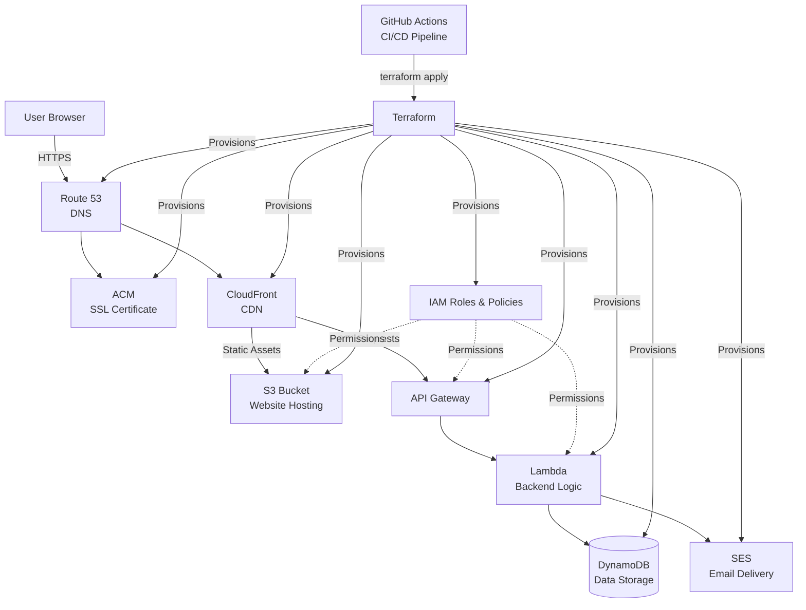

# Project Name


# AkinTechnologies Website

A production website hosted entirely on AWS, with all infrastructure provisioned as code using Terraform and deployments automated through GitHub Actions.

## Overview

This project demonstrates an end-to-end cloud architecture for hosting and serving a static website with serverless backend capabilities. Every piece of infrastructure — from DNS to compute to messaging — is defined in version-controlled Terraform configuration, eliminating manual setup through the AWS Console.

## Architecture



The site is built on the following AWS services, each provisioned through its own Terraform configuration:

| Service | Purpose |
|---|---|
| **S3** | Static website asset storage |
| **CloudFront** | Global CDN for fast, secure content delivery |
| **Route 53** | DNS management and custom domain routing |
| **ACM** | SSL/TLS certificate management for HTTPS |
| **API Gateway** | REST API endpoint for backend functionality |
| **Lambda** | Serverless compute for backend logic |
| **DynamoDB** | NoSQL data storage |
| **SES** | Transactional email delivery |
| **IAM** | Least-privilege roles and permissions |

## CI/CD

Deployments are automated via **GitHub Actions** (`.github/workflows`), so infrastructure and site changes are deployed automatically on push, following a repeatable, version-controlled pipeline rather than manual deployment steps.

## Project Structure

```
.
├── .github/workflows/      # CI/CD pipeline definitions
├── acm.tf                  # SSL certificate configuration
├── apigateway.tf           # API Gateway setup
├── cloudfront.tf           # CDN distribution
├── dynamodb.tf             # Database table definitions
├── iam.tf                  # IAM roles and policies
├── lambda.tf               # Lambda function configuration
├── lambda.zip               # Packaged Lambda deployment code
├── providers.tf             # Terraform provider configuration
├── route53.tf               # DNS records
├── s3.tf                    # S3 bucket configuration
├── ses.tf                   # Email service configuration
├── bucket-policy.json       # S3 bucket access policy
├── bucket-policy-oac.json   # Origin Access Control policy for CloudFront
├── index.html                # Site homepage
├── cloud-architecture-migration.html
├── cloud-cost-optimization.html
├── cloud-security.html
├── devops-automation.html
├── import.sh                 # Resource import script
└── cleanup.sh                 # Teardown/cleanup script
```

## Tech Stack

- **Infrastructure as Code:** Terraform (HCL)
- **CI/CD:** GitHub Actions
- **Frontend:** HTML
- **Cloud Provider:** AWS

## Key Highlights

- 100% infrastructure-as-code deployment — no manual console configuration
- Fully automated CI/CD pipeline for repeatable deployments
- Serverless backend architecture (API Gateway + Lambda + DynamoDB)
- Global content delivery via CloudFront with custom domain and HTTPS
- Includes teardown automation (`cleanup.sh`) for safe resource removal

## Getting Started

1. Clone the repository
2. Configure AWS credentials
3. Initialize Terraform:
   ```bash
   terraform init
   ```
4. Review the planned changes:
   ```bash
   terraform plan
   ```
5. Apply the configuration:
   ```bash
   terraform apply
   ```

## Author

**Oladayo Akinlonu**
AWS Certified Solutions Architect – Associate
[GitHub](https://github.com/akinlonudayo) · [LinkedIn](#)